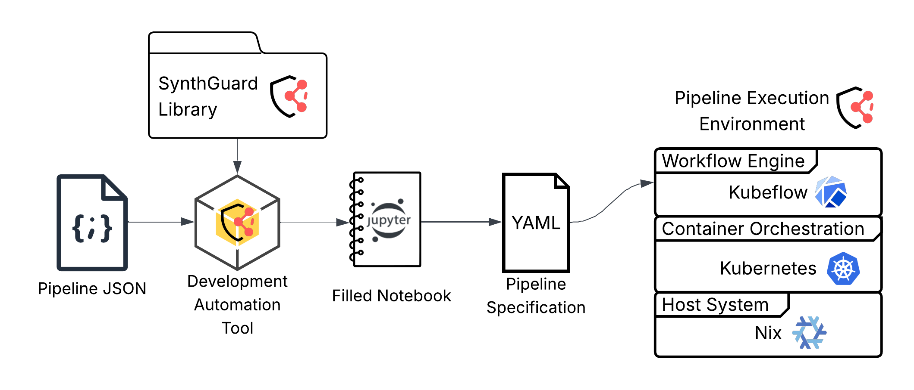

# SynthGuard

## Architecture Description

### Development Automation Tool

**Input:** JSON file specifiying structure of desired SDG pipeline.

**Output:** Pre-filled Jupyter Notebook using the SynthGuard Library.

### Jupyter Notebook

Each component can be ran locally in the cells. Functions containing component code can be connected to each other and then compiled into an Argo Workflows YAML file.

### Pipeline Execution Environment

The YAML specification is executed within a layered stack of platforms:
- **Kubeflow Workflow Engine:** Executes the specified workflow
- **Kubernetes Orchestration Platform:** Manages resources and deployment across containers
- **Nix Host System:** Ensures reproducibility and consistent runtime environments

## Project file tree

### **`automation/`**
Automates the generation of pipeline notebooks and configurations.
- `main.py`: Entry point for generating pipeline notebooks.
- `notebook_generator.py`: Contains logic for creating Jupyter notebooks based on pipeline configurations.
- `configs/`: Stores JSON configuration files for pipelines.
- `generated_content/`: Contains auto-generated pipeline notebooks.

### **`docker/`**
- `Dockerfile`: Defines the base image and dependencies for running the framework in a containerized environment.

### **`docs/`**
- `architecture.md`: Describes the architecture of the framework.
- `usage.md`: Provides instructions for using the framework.

### **`nix/`**
Contains Nix scripts for setting up the development environment and deploying pipelines.
- `connect.nix`: Configures connections for external services.
- `kfp-start.nix`: Automates the setup of Kubeflow Pipelines and related services.

### **`pipelines/`**
Houses pipeline definitions and related components. Each subdirectory represents a specific pipeline with YAML definitions, notebooks, and scripts.

### **`synthguard-library/`**
Core library containing reusable modules for data processing, synthetic data generation, and evaluation.
-  `synthguard/`: Contains Python modules for helper functions, data preprocessing, synthetic data generation, and report generation.