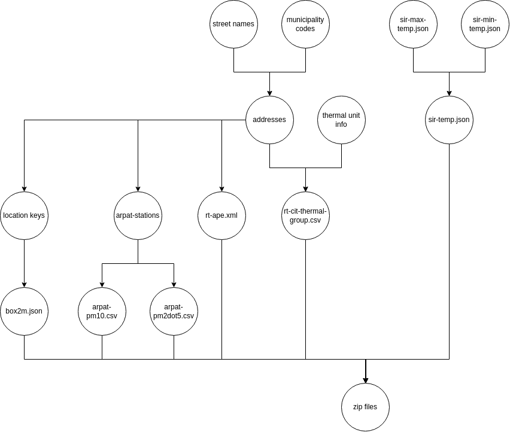

# Energy Pilot - TEADAL

## Pipeline Description

The generation of these datasets can be partitioned into several tasks. The purpose of this task is to demonstrate the generation of the synthetic data for this pilot. There is no need to fully replicate or recreate the original datasets. Focus only on demonstrating the feasibility of creating a pipeline. The generated records can be partial records with just a few columns or data types. Follow and adapt the code in this [Jupyter Notebook file](./notebook.ipynb). Choose small suitable input sizes for demonstration purposes, and try to schedule this pipeline to run once per day.

## Data Description

This folder contains a [Jupyter Notebook file](./notebook.ipynb) with the script code that generates the synthetic data.

### Summary

* [RT-CIT](datasets/rt-cit-schema.csv) (relational data): thermal and AC systems check reports
* [RT-APE](datasets/rt-ape-example.xml) (XML certificates, validated by .XSD schema): buildings' energy performance certificates
* [SIR-max-temp](datasets/sir-max-temp.json) (JSON, open data from API): daily maximum temperature values per region, between 2009 and 2023
* [SIR-min-temp](datasets/sir-min-temp.json) (JSON, open data from API): daily minimum temperature values per region, between 2009 and 2023
* [ARPAT](datasets/arpat.json) (JSON, open data from API): daily air quality values per region, for P10 and P2.5 measurements
* [BOX2M](datasets/box2m-ex.json): environmental sensors and energy consumption datasets, later accessible from their REST API.

### Description

This pilot’s data consists of an aggregation of structured, document-based, time-serialised, and historical records, both of public and private, or restricted, nature. 

A considerable portion of the data comes from the *Settore Idrologico e Geologico Regionale* of Tuscany region, which provides open and free historical data, updated on a daily basis, regarding all kinds of hydrometric, rainfall, or thermometry records. Of those, the ones of concrete interest are part of the thermometry data, more specifically, the historical records of maximum and minimum temperatures across the multiple subregions and municipalities of the Tuscany region. This open data has been gathered and bulk-downloaded, comprising periods from 2009 to 2023 of recorded temperatures, and stored in a structured JSON format. Another open source of data is the *Agenzia regionale per la protezione ambientale della Toscana*, which freely provides daily air quality values in some Tuscany specific subregions.

Another slice of the data comes from the Tuscany region’s thermal and energy performance certificates databases. These certificates include specific information about the combustion and energy efficiency, or rating, of registered buildings, plants and thermal units. This data, however, is not publicly accessible, but presents a defined structure and comprehensible schemas. For instance, the thermal archive is known to be kept in a relational dataset, with distinguishable columns, that shall contain atomic information regarding the regional and thermal group codes, addresses, and combustion efficiency values. The energy performance certificates follow a specific XML schema definition and hold values for addresses and energy ratings. Since only the schemas were provided by the pilot, all this data shall be synthesised, with no considerations to be made in regard to privacy or confidentiality of the data. The correlation between data points is also of little to no importance and the values will be randomly generated, only in accordance to the specificities of their ranges, data types and overall volumes. 

The remaining data is from BOX2M and includes their environmental sensors and energy consumption datasets. The dimensions and measures of interest are related to addresses, timestamps and the sensor-measured values. This API is set to respond in a structured JSON format, with the time stamped and time serialised data being stored in a non relational database, with no direct structural relationships between the records.

As a final note, one of the goals is to have a normalised and uniform representation of the common territorial identifiers, namely, the plants’ addresses and municipality identifiers, across the different datasets, in order to calculate specific joint, static and dynamic, measures.

